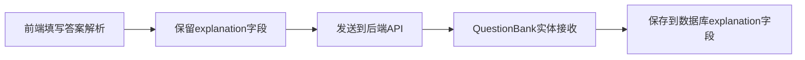

# 答案解析功能修复说明

## 🔍 问题分析

### 问题现象
1. 预览和编辑页面，答案解析没有回显
2. 编辑题目时，答案解析无法保存
3. 编辑题目报错：`Unknown column 'option_list' in 'field list'`

### 根本原因
1. **数据库缺少字段**：`question_bank`表缺少`explanation`字段
2. **实体类字段问题**：
   - 缺少`explanation`字段
   - 非数据库字段未添加`@TableField(exist = false)`注解
3. **前端阻止保存**：代码中主动删除`explanation`字段

---

## 🛠️ 解决方案

### 1. 数据库结构修复
**新增字段**：
```sql
ALTER TABLE question_bank 
ADD COLUMN explanation TEXT COMMENT '答案解析' 
AFTER correct_answer;
```

**修复后的表结构**：
```sql
CREATE TABLE question_bank (
    id BIGINT AUTO_INCREMENT PRIMARY KEY,
    title TEXT NOT NULL,
    type INT NOT NULL,
    content TEXT,
    options JSON,
    correct_answer TEXT,
    explanation TEXT,  -- ✅ 新增答案解析字段
    priority INT DEFAULT 1,
    score INT DEFAULT 1,
    difficulty INT DEFAULT 1,
    tags VARCHAR(500),
    status INT DEFAULT 1,
    creator_id BIGINT,
    create_time DATETIME DEFAULT CURRENT_TIMESTAMP,
    update_time DATETIME DEFAULT CURRENT_TIMESTAMP ON UPDATE CURRENT_TIMESTAMP,
    deleted INT DEFAULT 0
);
```

### 2. 后端实体类修复
**QuestionBank.java修复**：
```java
@Data
@TableName("question_bank")
public class QuestionBank {
    // ... 其他字段 ...
    
    @Schema(description = "正确答案（客观题使用，主观题为NULL）")
    private String correctAnswer;
    
    @Schema(description = "答案解析")  // ✅ 新增答案解析字段
    private String explanation;
    
    // ... 其他字段 ...
    
    // 非数据库字段 - 添加@TableField(exist = false)注解
    @TableField(exist = false)  // ✅ 修复SQL查询错误
    @Schema(description = "选项列表（解析后的JSON）")
    private List<String> optionList;
    
    @TableField(exist = false)  // ✅ 修复SQL查询错误
    @Schema(description = "题型名称")
    private String typeName;
    
    @TableField(exist = false)  // ✅ 修复SQL查询错误
    @Schema(description = "难度名称")
    private String difficultyName;
    
    @TableField(exist = false)  // ✅ 修复SQL查询错误
    @Schema(description = "创建者姓名")
    private String creatorName;
}
```

### 3. 前端代码修复
**QuestionBankManage.vue修复**：
```javascript
// 修复前：删除explanation字段
const questionData = { ...questionForm }
delete questionData.optionList
delete questionData.correctAnswerList
delete questionData.explanation  // ❌ 移除explanation字段，后端不支持

// 修复后：保留explanation字段
const questionData = { ...questionForm }
delete questionData.optionList
delete questionData.correctAnswerList
// explanation字段保留，后端已支持答案解析功能  ✅
```

---

## 📊 修复范围

### 涉及的文件
1. ✅ **数据库结构** - 添加`explanation`字段
2. ✅ **QuestionBank.java** - 新增`explanation`字段，修复`@TableField(exist = false)`注解
3. ✅ **QuestionBankManage.vue** - 移除删除`explanation`字段的代码

### 修复的功能
1. ✅ **创建题目** - 答案解析能正常保存到数据库
2. ✅ **编辑题目** - 答案解析能正常更新和回显
3. ✅ **预览题目** - 答案解析能正常显示
4. ✅ **SQL查询错误** - 修复`option_list`等字段不存在的错误

---

## 🔄 完整工作流程

### 1. 创建/编辑题目


### 2. 题目回显


---

## 🚀 功能验证

### ✅ 验证项目
1. **创建题目**：
   - 填写答案解析
   - 保存成功
   - 数据库中有explanation数据

2. **编辑题目**：
   - 打开已有题目
   - 答案解析正确回显
   - 修改后保存成功

3. **预览题目**：
   - 答案解析区域正常显示
   - 内容格式正确

4. **API接口**：
   - GET `/api/question-bank/{id}` - 返回explanation字段
   - POST `/api/question-bank` - 接收explanation字段
   - PUT `/api/question-bank/{id}` - 更新explanation字段

---

## 🎯 技术要点

### 1. MyBatis Plus注解使用
```java
// 数据库字段（自动映射）
private String explanation;

// 非数据库字段（需要排除）
@TableField(exist = false)
private List<String> optionList;
```

### 2. 前端数据处理
```javascript
// 发送到后端时，只删除非数据库字段
delete questionData.optionList      // 前端临时字段
delete questionData.correctAnswerList  // 前端临时字段
// explanation保留 - 是真实的数据库字段
```

### 3. 数据库字段映射
```
数据库字段名: explanation (TEXT)
Java字段名: explanation (String)
前端字段名: explanation (String)
```

---

## 📝 后续建议

### 1. 数据迁移（可选）
如果已有题目需要添加解析，可以批量更新：
```sql
-- 为现有题目添加默认解析
UPDATE question_bank 
SET explanation = '暂无解析' 
WHERE explanation IS NULL OR explanation = '';
```

### 2. 验证规则（可选）
可以在前端或后端添加解析内容的验证：
```java
@Schema(description = "答案解析", maxLength = 2000)
private String explanation;
```

### 3. 富文本支持（可选）
答案解析字段支持HTML或Markdown格式，提升用户体验。

---

**✅ 答案解析功能修复完成！现在创建、编辑、预览题目时答案解析都能正常工作了！** 